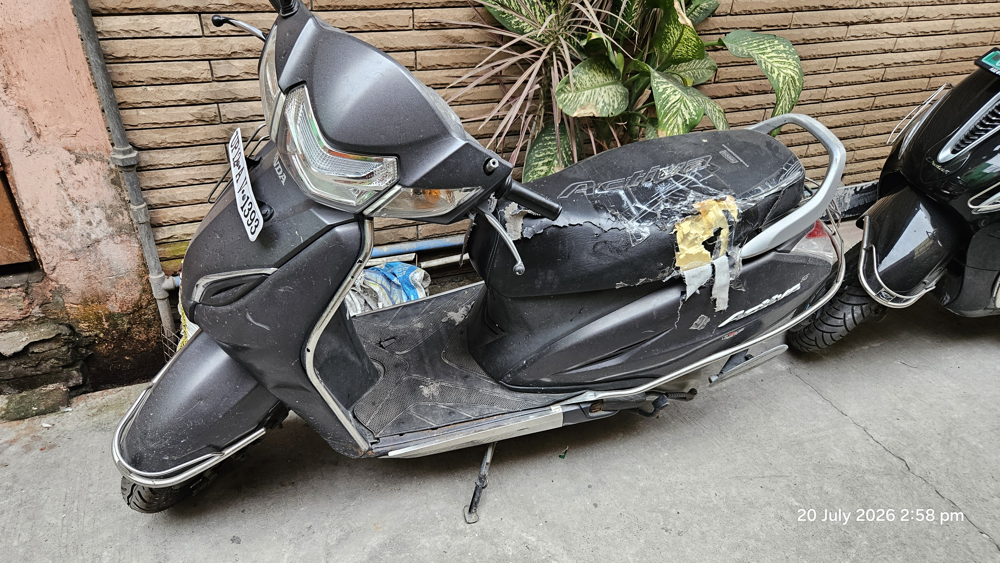
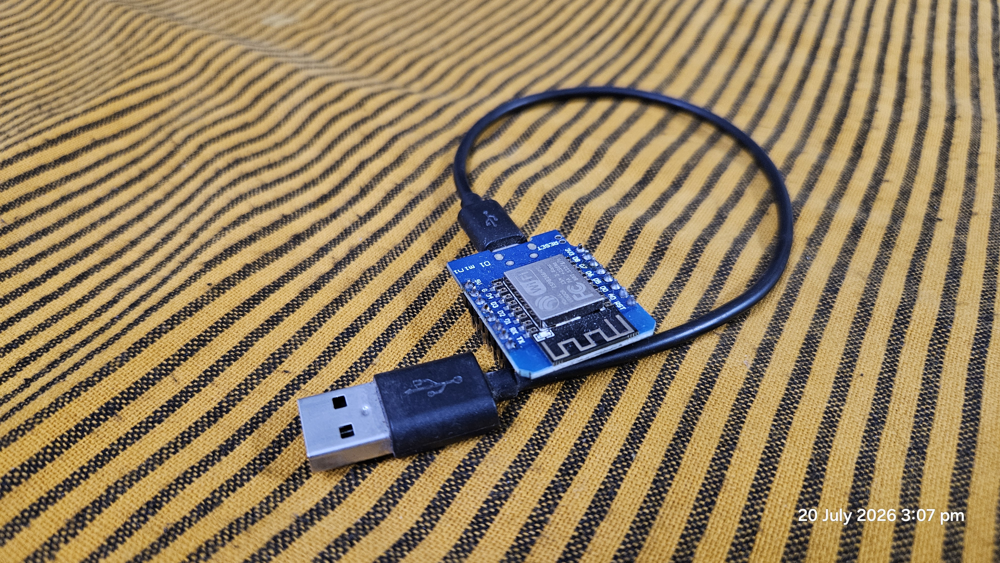

# Scarecrow-Vision 🐒🐕

[](https://studio.edgeimpulse.com/public/1062975/live)

<div align="center">
  
</div>

**Un-networked Edge AI Object Detection on Vintage Hardware**

This project transforms a legacy Raspberry Pi 2 into an intelligent edge-AI camera. Phase 1 focuses on offline computer vision: detecting specific target animals (dogs and monkeys) using a quantized FOMO model and printing alerts to the local console. The project is designed as an educational guide and proof-of-work for deploying highly optimized machine learning on resource-constrained embedded systems. You can view the live model data and training pipeline on our **[Public Edge Impulse Project](https://studio.edgeimpulse.com/public/1062975/live)**.

## ❓ Why Build This?
Stray dogs and monkeys are common in many neighborhoods and often cause severe damage to parked vehicles by scratching paint and chewing on exterior components (see example below). This project provides an intelligent, automated way to detect these specific animals as they approach and trigger a deterrent without requiring constant human monitoring.

<details>
  <summary><b>View typical vehicle damage caused by stray animals</b></summary>
  <div align="center">
    
    <p><i>Example of typical damage: A scooter with its seat heavily torn by local monkeys/dogs.</i></p>
  </div>
</details>

## 🧰 Hardware Used
* **Raspberry Pi 2 Model B** (900MHz ARMv7, 1GB RAM)
* Standard **USB 2.0 Web Camera**
* 16GB+ MicroSD Card
* Tenda USB Wi-Fi Adapter (for headless setup)
* 5V Micro-USB Power Supply

## 📚 Documentation Table of Contents

Follow our step-by-step guides to replicate this project:

1. [Hardware & OS Setup](docs/01-hardware-setup.md) - Headless Raspberry Pi 2 configuration.
2. [OS & Environment Prep](docs/02-os-and-environment.md) - System dependencies, legacy apt repos, and Python virtual environments.
3. [Training & Deployment](docs/03-training-and-deployment.md) - Data collection, FOMO model training with Edge Impulse, and running inference.

## 🚀 Quick-Start Guide

Once your environment is set up and the model (`modelfile.eim`) is downloaded, activate your environment and run the pipeline:

```bash
# 1. Activate the virtual environment
source scarecrow_env/bin/activate

# 2. Run the terminal-based inference script
python3 src/scarecrow.py
```

### Script Variations
* **`src/scarecrow_stream.py`**: A Flask-based stream meant for **demonstration purposes**. It overlays bounding boxes on the live video feed so you can visually see exactly what the FOMO model is doing to the frames in real-time.
  <details>
    <summary><b>View stream demonstration</b></summary>
    <div align="center">
      <br>
      
      <p><i>Terminal starting the streaming server.</i></p>
      
      <p><i>Live stream Edge Inference Console showing bounding boxes on the target.</i></p>
    </div>
  </details>
* **`src/scarecrow.py`**: The main headless runner. This is optimized for integration with microcontrollers. It can be easily modified to send network triggers to an ESP8266-based project (e.g., [ESP Secure Gate](https://github.com/makexindia/esp_secure_gate)) to sound an alarm or actuate a physical deterrent when a target is detected!
  <details>
    <summary><b>View headless script output</b></summary>
    <div align="center">
      <br>
      
      <p><i>Terminal output showing target detection events and confidence scores.</i></p>
    </div>
  </details>

## 🔮 Future Integration Teaser
*(Phase 2: Connecting the edge AI brain to physical actuation via ESP8266)*
<div align="center">
  
</div>
